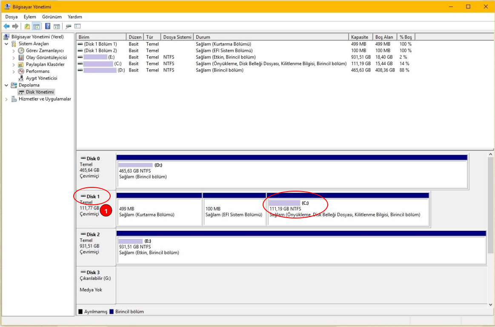

# GNU/Linux Kurulum Diskinin Hazırlanması

Öncelikle GNU/Linux kurulumunu nasıl yapacağımızı bilmemiz gerekir. Bunun için doğru yazıyı okuyorsunuz.

## ➡️ GNU/Linux'u Başka bir İşletim Sisteminin Yanına Kurmak İstiyorum.

Buradaki başka işletim sistemimiz örnek olarak Windows 10 olsun. Öncelikle Windows 10 işletim sistemimize zarar vermemek için **MBR** veya **GPT** olarak mı yazılmış olduğunu bilmemiz gerekiyor. Ayrıca **UEFI** mi yoksa **Legacy** kurulu mu olacağını belirlememiz gerekiyor. Windows üzerinden bunu öğrenmek için aşağıdaki işlemleri uygulamamız gerekiyor. Kurulum Diskimizi bu bilgilere göre yapılandıracağız. Kurulum diskini rastgele yapılandırırsak, kurulumu yaptıktan sonra Windows 10 açılmayabilir.

### Adım.1

Sistemin UEFI mi Legacy mi olduğunu öğrenelim.

Masaüstündeyken **CTRL + R** tuşlarına basalım. Açılan **Çalıştır** penceresine `msinfo32` yazıp onaylayalım. Açılan pencerede **Sistem Bilgisi** bölümüne girelim. Sağ tarafta **BIOS Modu** bölümünde yazan sonucta bunu öğrenebiliriz. Eğer `Eski` yazıyor ise **Legacy** anlamına gelir. `UEFI` yazıyorsa zaten **UEFI** demektir.

### Adım.2

Bu adımda Windows 10'un kurulu olduğu diskin **MBR** mi yoksa **GPT** mi olduğunu öğrenelim. Bunun için **Disk Yönetimi** programını açalım.

Yukarıdaki resimde `C:` bölümlendirmesi `Disk 1` üzerinde yer alıyor. Bizim bu diskin bölümleme stilini öğrenmemiz gerekiyor. Sizin sisteminizde `C:` bölümlendirmesi hangi diskin içindeyse o diskin bölümleme stilini öğrenmeniz gerekecek. Bunun için Diskinizin üzerine sağ tıklayın. Resimde bu diskimiz `Disk 1` olduğu için kırmızı dairedeki 1 yazan yere sağ tıklıyoruz ve **Özellikler** seçeneğine tıklıyoruz.

Açılan ufak pencerede **Birimler** sekmesine geçelim. Hemen aşağıda **Bölümleme stili:** yazısının karşısında cevabımız yazıyor olacak. Buna göre **MBR** mi **GPT** mi öğrenebiliriz.

## ➡️ Diskime Sadece GNU/Linux İşletim Sistemini Kuracağım.

Eğer bu seçeneği tercih ediyorsanız, işimi bir hayli kolay olacak. Bu seçenekte önerilen ayarlar **UEFI** ve **GPT** tipinde olacak.

## ✨ Kurulum Diskine Kurulum Medyasının Yazılması

Öncelik bu işlemi yapmadan önce hangi distroyu kuracağınızı belirlemeniz gerekir. Seçiminizi yaptığınızı varsayarak işleme devam ediyoruz. Kurulum diski olarak USB Stick  \(Flash Bellek veya USB Bellek de denir.\) kullanacağız. Şuanda 4GB ve üzeri alanı olan bir USB Stick tercih edilebilir.

ISO dosyamızı indirdikten sonra bize iso'yu USB Stick'e yazdırmak için bir program gerekiyor. Sizlere popüler olan [Rufus](https://rufus.ie/) programını tavsiye ederim. Dökümanın geri kalan kısmında bu programı kullanacağız.

Yapacağımız işlemler çok basit.

1. **Device** bölümünden USB Stick'imizi seçelim.
2. **Boot Selection** bölümünden indirdiğimiz **iso** dosyasını seçelim.
3. **Partition scheme** bölümünden Diskinizin mevcut Bölümleme stilini seçin. **\[MBR/GPT\]**
4. **Target** **Sistem** bölümünden  mevcut **BIOS** modunuzu seçin  **MBR** seçtiyseniz **BIOS or UEFI**'yi **GPT** seçtiyseniz **UEFI \(non CSM\)** seçebilirsiniz.
5. Daha sonra aşağıdaki ayarları değiştirmeden **START** butonuna basıp yazdırma işlemini başlatabilirsiniz.

İşlem tamamlandıktan sonra GNU/Linux işletim sitemini kurma bölümü sisizn seçtiğiniz sisteme göre değişiklik gösterecektir.

Bunun için topluluklardan veya YouTube videolarından faydalanabilirsiniz.

## ❗Önemli Bir Tavsiye

Eğer bir doküman veya video yardımı ile kurulumu yapmaya çalışıyorsanız, önce dökümanı veya videoyu baştan sona incelemenizde yara vardır. İşlemlerinizi daha sonra yapmanız güvenli bir yol olacaktır.

