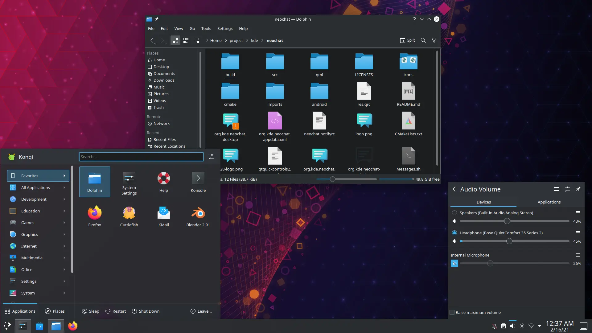

# Masaüstü Ortamları \(Desktop Environments\)

GNU/Linux işletim sistemlerini diğer İS'lerden ayıran en büyük özelliklerden biri masaüstü tasarımınızı özgürce değiştirebilmenizdir. Bilinen veya bilinmeyen  birçok masaüstü ortamı bulunmaktadır. Bu kadar çeşitliliğin olabilmesindeki en büyük etken açık-kaynak geliştirme sayesindedir.

Bu masaüstü ortamlarından hangisini seçeceğimizde özgür olmakla beraber, kullandığımız masaüstü ortamının birçok özelliğini gerek tasarım ayarları kısmından gerekse yazılımsal olarak değiştirmekte özgürüz.

Kullandığımız GNU/Linux dağıtımı varsayılan olarak bir masaüstü ortamı ile geliyor olabilir. Eğer kullandığımız dağıtımın istediğimiz masaüstü ortamı ile gelen varyasyonu var ise bu varyasyonu tercih edebiliriz ya da zaten sisteminizi çoktan kurduysanız, birkaç ayar ile masaüstü ortamınızı değiştirebilirsiniz.

Bu yazıda en popüler masaüstü ortamlarını listeliyor olacağım. Sıralama bir istatistiğe göre yapılmamıştır.

## KDE Plasma

KDE tarafından geliştirilen bu masaüstü ortamı en çok özelleştirme seçeneği sunan masaüstü ortamıdır. Varsayılan olarak sade bir tasarım ile gelir. Özelleştirmedeki bol çeşitliliğiyle nasıl bir ortama dönüştürebileceğiniz sizin hayal gücünüze kalmış birşey.

**Yazıldığı diller ve kütüphaneler:** C++, QML

**Geliştiren:** KDE

**Çıkış tarihi:** 15 Temmuz 2014

### Video



Daha fazla detay için [Plasma](https://kde.org/plasma-desktop/)'nın sitesine göz atın.

### Bonus

Aşağıdaki görüntüde KDE Plasma'yı kendi zevkime göre kullandığım halini görebilirsiniz.

## GNOME

Bu masaüstü ortamı da GNOME Projesi kapsamında geliştirilen bir masaüstü ortamıdır. Sadedir ve geleneksel masaüstü tasarımına aykırı bir tasarımı benimser.

**Yazıldığı diller ve kütüphaneler:** JavaScript, C

**Geliştiren:** The Gnome Project

**Çıkış tarihi:** 6 Nisan 2011

### Video



Daha fazla detay için [Gnome](https://www.gnome.org/)'un sitesine göz atın.

## XFCE

XFCE, hafif ve geleneksel bir masaüstü ortamıdır. Tasarımı biraz eski kaldığı için genellikle cihaz donanımı düşük seviye olan kullanıcılara tavsiye edilir. Ortalama bir özelleştirme seçeneği vardır.

**Yazıldığı diller ve kütüphaneler:** C

**Geliştiren:** Özgür Yazılım Topluluğu

**Çıkış tarihi:** 1996

### Video



Daha fazla detay için [XFCE](https://xfce.org/)'nin sitesine göz atabilirsiniz.

## Cinnamon

Cinnamon, geleneksel tarzda masaüstü seven kullanıcılara hitap eden, sade bir masaüstü ortamıdır.

**Yazıldığı diller ve kütüphaneler:** C, JavaScript, Python

**Geliştiren:** Linux Mint Ekibi

**Çıkış tarihi:** 2011

### Video



## Deepin DE

Deepin DE, Deepin Linux için geliştirilen bir masaüstü ortamıdır. İsterseniz Deepin Linux'ten başka diğer dağıtımlara da yükleyebilirsiniz.

**Yazıldığı diller ve kütüphaneler:** C++, QML, Qt

**Geliştiren:** Wuhan Tech.

**Çıkış tarihi:** 28 Şubat 2004

### Video



Data fazla detay için [Deepin Linux](https://www.deepin.org/en/dde/)'un sitesine göz atabiliriniz.

## Diğer masaüstü ortamlarının listesi

* [Lxde](https://www.lxde.org/)
* [Lxqt](https://lxqt-project.org/)
* [Mate](https://mate-desktop.org/)
* [UKUI](https://www.ukui.org/)
* [Budgie](https://ubuntubudgie.org/)

