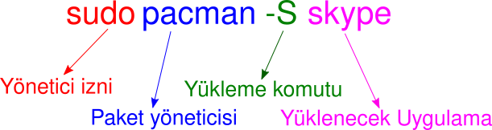

# Uygulama Depoları ve Paket Yöneticileri

Birçok GNU/Linux dağıtımının kendine özel Uygulama Deposu \(Uygulama Mağazası\) ve Paket Yöneticisi \(Komut satırından uygulama yöneticisi\) bulunur. Dağıtımları birbirinden ayıran en temel özellik budur.

Dağıtıma özel bir uygulama mağazası bulunabileceği gibi komut satırından paket yönetimi aracı da bulunur.

## APT - Advanced Packaging Tool \(Gelişmiş Paketleme Aracı\)

Debian tabanlı dağıtımlarda kullanılır. \(Ubuntu, Elementary, Linux Mint, Pop! Os, Pardus\)

Örnek kullanım:

Paket yükleme işlemi için yönetici izni gereklidir. Bunun için yükleme komutumuzun başına "`sudo`" yazmamız gerekir. Komutlarımızı sudo yazarak kullanırsak bize yönetici şifresi soracaktır. Şifremizi girerken haneler gösterilmeyecektir. Bunun için şifrenizi yazamadığınızı düşünmeyin. Bu güvenlik amaçlıdır.

Örnek uygulama/paket kaldırma komutu:

> sudo apt remove skype

Daha fazla komut için kullandığınız dağıtım için araştırma yapabilirsiniz.

APT paket yöneticisine daha fazla paket eklemek için repo'lardan faydalanabilirsiniz. Nasıl repo ekleneceğini kolayca araştırıp bulabilirsiniz.

## Pacman - Package Manager \(Paket Yöneticisi\)

Arch Linux tabanlı Dağıtımlarda kullanılır. \(Manjaro Linux, Archman Linux, Antergos, Arco Linux\)

Örnek uygulama/paket kaldırma komutu:

> sudo pacman -R skype

Arch tabanlı dağıtımlarda ek olarak AUR mevcuttur. AUR - Arch User Repository \(Arch Kullanıcı Deposu\) üzerinden GNU/Linux kullanıcı uygulamaları burada barındırılır. Bu sayede Arch üzerinde uygulama çeşitliliği çoğaltılmıştır.

AUR'dan paket yüklemek için Pamac \(GUI\), Octopi \(GUI\), yay \(CLI\) gibi uygulamalardan faydalanabilirsiniz.

## Diğer paket yöneticileri

* Snap \(Tüm dağıtımlar için\)
* Flatpak \(Tüm dağıtımlar için\)
* yum \(Fedora\)
* dnf \(Fedora\)
* Portage \(Gentoo\)

